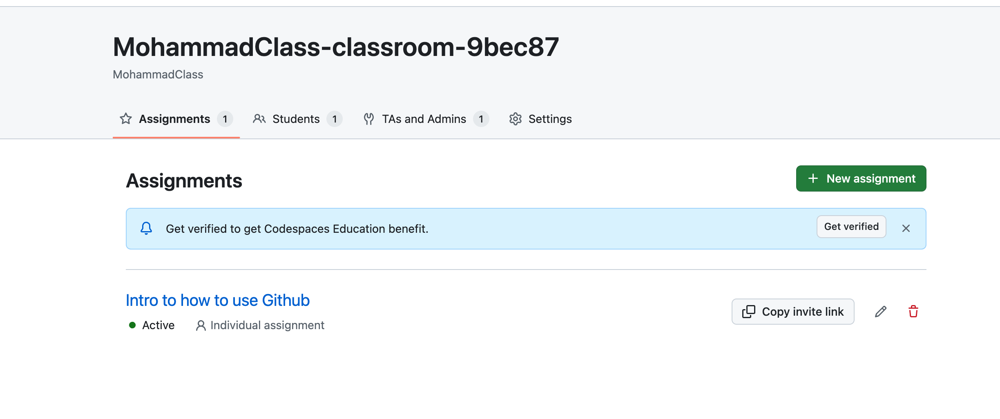
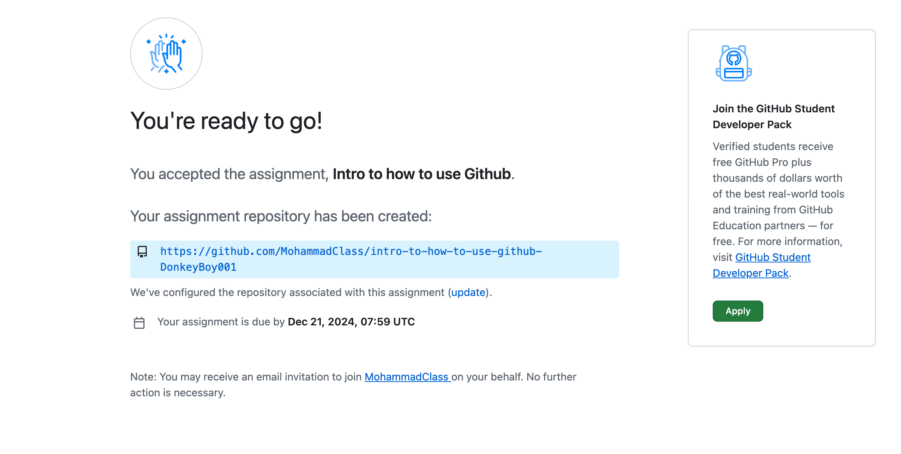

[](https://classroom.github.com/a/hbPDiJxe)
# GithubDemo

## Instructions: How to Clone the Repository

1. copy the link of github In the red box

   

2. open terminal

> for Mac, you can use `command` + space  ---> open Spotlight Search
>
> type 'terminal' and press enter
>
> 


3. go to your desk in termial

```bash
cd Desktop
```

4. git clone the link

```bash
eg: this is just one example, please use your homework link
git clone https://github.com/MohammadClass/xxxxx
```

the below is a real example show case


5. enter the createed file

> If the file name is homework1
> you gnona find a new file which named homework1 file in your desk
>
> type the `filename`in your terminal

```bash
cd homework1
```

## How to Push Changes Back

Here is when you finish your homework, you can update the homework to github with the following command.

1. ```bash
   git add .
   ```

2. ```bash
   git commit -m "you can comment whatever you want here"
   ```

3. ```bash
   git push 
   ```


## ClassRoom in Github

https://github.com/MohammadClass

### ClassRoom invitation

https://classroom.github.com/classrooms/173418871-mohammadclass-classroom-9bec87



### Assignment Invitation

https://classroom.github.com/assignment-invitations/f835ab3eb3ba8eeaa143770f0a0d73d6/status



### TA invitation

https://classroom.github.com/classrooms/173418871-mohammadclass-classroom-9bec87/settings/invitations


https://classroom.github.com/classrooms/173418871-mohammadclass-classroom-9bec87


## Automatic Grading and feedBack show case


